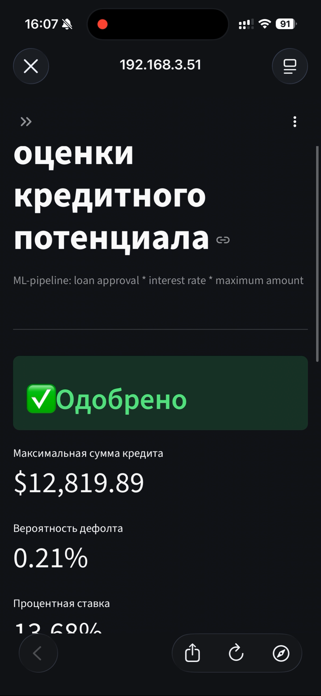

# Credit Risk Scoring System

Python \
LightGBM \
Optuna \
License
  
ML-pipeline for automated credit decisioning: **loan approval**, **interest rate** and **maximum loan amount** prediction 
  
---  
  
## Problem Statement  
  
Given a loan applicant's profile, the system answers three questions:  
  
| Question                                    | Task           | Target          |
| ------------------------------------------- | -------------- | --------------- |
| Will the client default? → Approve / Reject | Classification | `loan_status`   |
| What interest rate fits this client?        | Regression     | `loan_int_rate` |
| What is the maximum safe loan amount?       | Regression     | `loan_amnt`     |
  
Models work as a **cascade**: rate and amount are predicted only for approved applicants.  
  
---  

## Demo

| Applicant Form               | Decision | SHAP Explanation |
|------------------------------| --- | --- |
|  |  |  |

---
  
## Results  
  
### Approval Model (LightGBM Classifier)  
  
| Metric           | Score      |
| ---------------- | ---------- |
| ROC-AUC          | **0.9475** |
| PR-AUC           | **0.9024** |
| Gini Coefficient | **0.8951** |
| KS-Statistic     | **0.7539** |
| F1-Score         | **0.8260** |
  
### Interest Rate Model (LightGBM Regressor)  
  
| Metric | Score      |
| ------ | ---------- |
| MAE    | **0.81%**  |
| RMSE   | **1.03%**  |
| R²     | **0.8828** |
  
### Loan Amount Model (LightGBM Regressor)  
  
| Metric | Score      |
| ------ | ---------- |
| MAE    | **$1,841** |
| RMSE   | **$3,351** |
| R²     | **0.7062** |
  
---  
  
## Pipeline Architecture

Raw Data  

│  
▼  

Outlier Removal & Validation

│  
▼

Feature Engineering (7 new features)

│  
▼ 

sklearn Pipeline (Imputation -> Encoding -> Scaling)

│  
▼

Approval Model (LightGBM + Optuna)  
  
├── Reject  
└── Approve  
|    ├── Rate Model (LightGBM Regressor)  
|    └── Amount Model (LightGBM Regressor)

---  
  
## Dataset  
  
[Credit Risk Dataset — Kaggle]([https://www.kaggle.com/datasets/laotse/credit-risk-dataset](https://vk.com/away.php?to=https%3A%2F%2Fwww.kaggle.com%2Fdatasets%2Flaotse%2Fcredit-risk-dataset&utf=1))  
  
32,581 records · 12 features · 21.8% default rate  
  
---  
  
## Project Structure

credit-risk-ml/  
├── config.py ← paths, features, constants  
├── data/  
│ └── credit_risk_dataset.csv  
├── notebooks/  
│ └── eda.ipynb ← Exploratory Data Analysis  
├── src/  
│ ├── preprocessing.py ← cleaning, outliers, split, pipeline  
│ ├── feature_engineering.py ← 7 engineered features  
│ ├── models.py ← LightGBM + Optuna tuning  
│ ├── train.py ← training entrypoint  
│ ├── evaluate.py ← metrics + plots + SHAP  
│ └── run_evaluation.py ← evaluation entrypoint  
├── models/ ← saved .pkl models  
└── reports/figures/ ← all generated plots

---

## Quick Start  
  
```bash  
# 1. Clone and install  
git clone [https://github.com/hs4hck6zt8-collab/credit-risk-ml.git](https://vk.com/away.php?to=https%3A%2F%2Fgithub.com%2Fhs4hck6zt8-collab%2Fcredit-risk-ml.git&utf=1)  
cd credit-risk-ml  
pip install -r requirements.txt  
  
# 2. Download dataset from Kaggle  
# Place credit_risk_dataset.csv into data/  
  
# 3. Train all models (~10 min)  
python src/[train.py](https://vk.com/away.php?to=https%3A%2F%2Ftrain.py&utf=1)  
  
# 4. Evaluate and generate plots  
python src/[run_evaluation.py](https://vk.com/away.php?to=https%3A%2F%2Frun_evaluation.py&utf=1)
```

---

## Methodology

### Feature Engineering

- log_income - log-transform of right-skewed income
- debt_to_income - loan amount / annual income
- grade_num - ordinal encoding of loan grade (A=1, B=2, ... G=7)
- emp_income_interaction - employment stability * income signal
- high_risk_intent - flag for DEBTCONSOLIDATION, MEDICAL, VENTURE
- income_per_age - career trajectory proxy
- cred_hist_per_age - credit history relative to age

### Hyperparameter Tuning

Optuna with 50 trials,  TPE samler. Search space covers:

n_estimators, learning_rate, num_leaves, min_child_samples, subsample, colsample_bytree, reg_alpha, reg_lambda

### Class Imbalance

21,8% default rate handled via class_weight="balanced"+threshold tuning on validation set to maximise F1

### Explainability

SHAP TreeExplainer for all three models - global feature importance (beeswarm) saved to reports/figures/

## License

MIT License